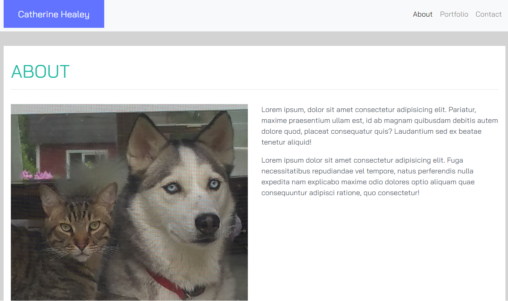

# Homework 02 CSS Bootstrap

> A simple 3 page portfolio site styled with bootstrap.

This is a class exercise in learning bootstrap and part of a full stack flex bootcamp.



## Installation

OS X & Linux:

```sh
npm install my-crazy-module --save
```

Windows:

```sh
edit autoexec.bat
```

## Usage example

THes pages can be used as an example of how to complete your homework assignment for Week 2. Replace the images and fill in your personal information. Modify it to make it your own. Pull it apart and look up each component in the getbootstrap docs.

_For more examples and usage, please refer to the [Wiki][wiki]._

## Development setup

To install, clone or download this repo. Drag the index.html file to a browser tab.
There is no test suite for these pages.

Create you own repo on github to store and track you changes.  
set the remote repo to your new project repo with

## Release History

- 0.0.1
  - Work in progress

## Meta

Catherine Healey – [@cfhealey](https://twitter.com/cfhealey) – cathy.healey@gmail.com

Distributed under the MIT license. See `LICENSE` for more information.

[https://github.com/c-healey/02-homework-css-bootstrap/](https://github.com/c-healey/)
